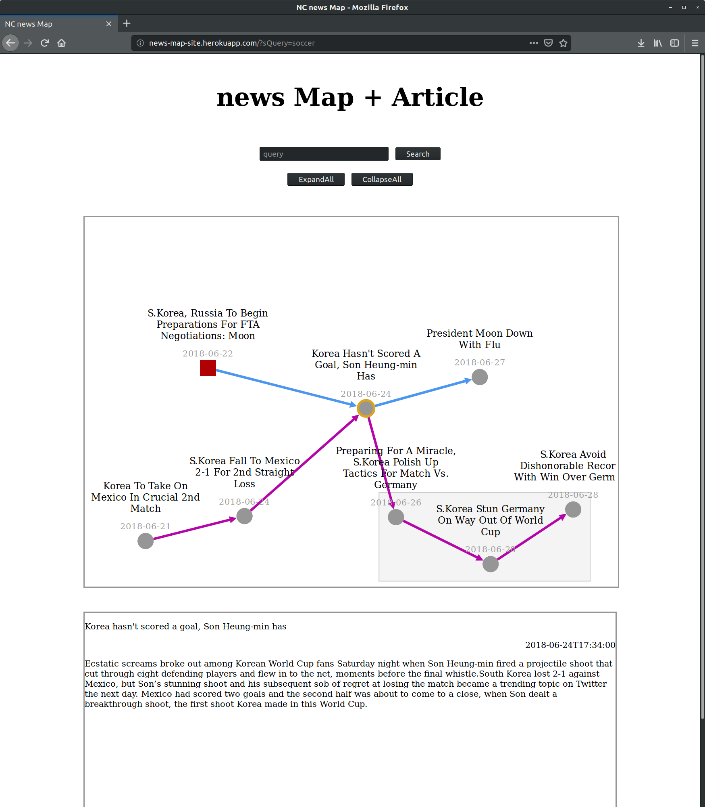
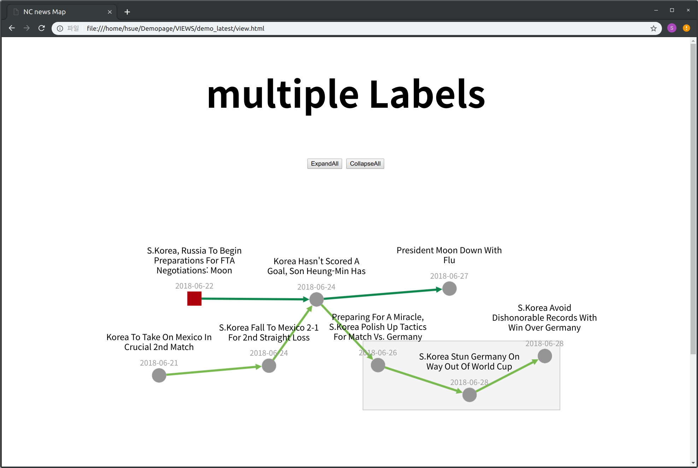
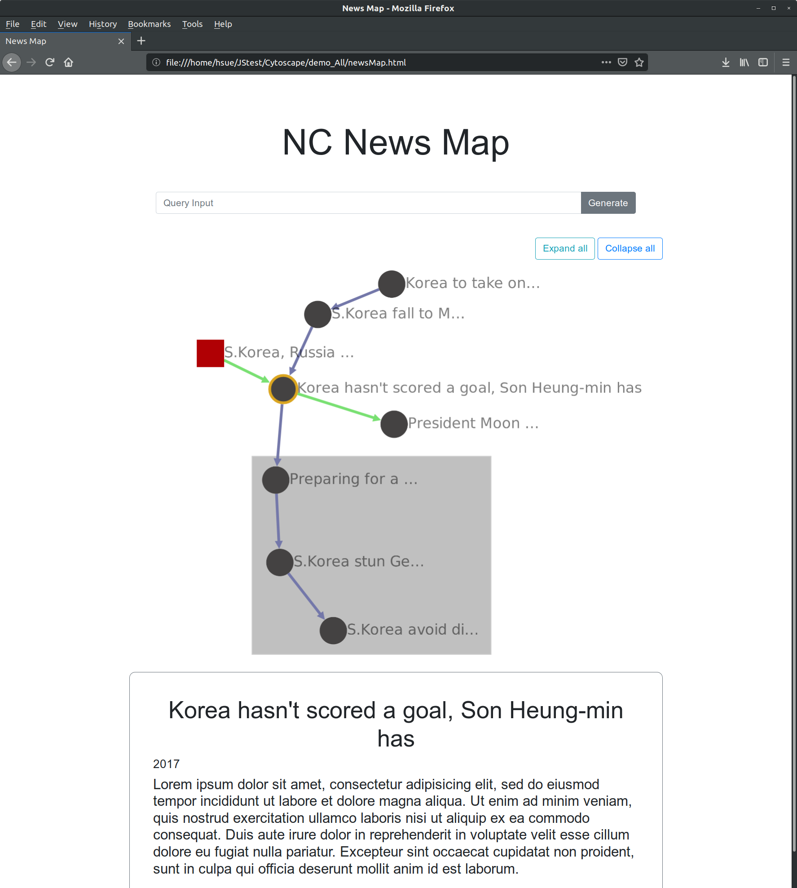

# Cytoscape
* ## News Map with article
  
  - http://news-map-site.herokuapp.com/ : query로 soccer, greece만 가능
  - "dependencies": {
    "cytoscape": "^3.1.0",
    "cytoscape-expand-collapse": "^3.1.2",
    "cytoscape-node-html-label": "^1.1.2",
    "ejs": "^2.6.1",
    "express": "^4.16.4",
    "jquery": "^3.3.1"
  }

* ## Multi-label Demo
  
  * [cytoscape-expand-collapse]("https://github.com/iVis-at-Bilkent/cytoscape.js-expand-collapse") : expandable/collapsable node 생성
  * [cytoscape-node-html-label]("https://github.com/kaluginserg/cytoscape-node-html-label") : label을 html형태로 작성할 수 있게 해주는 library

* ## demo-All
  : 아래 기능들 종합
  

  - demo_comp+mouse : 마우스 오버기능 + 그룹화
  - demo_comp : 그룹화기능
  - demo_mouse : 마우스 오버기능
  - demo_vuetest : 뷰사용해본거
